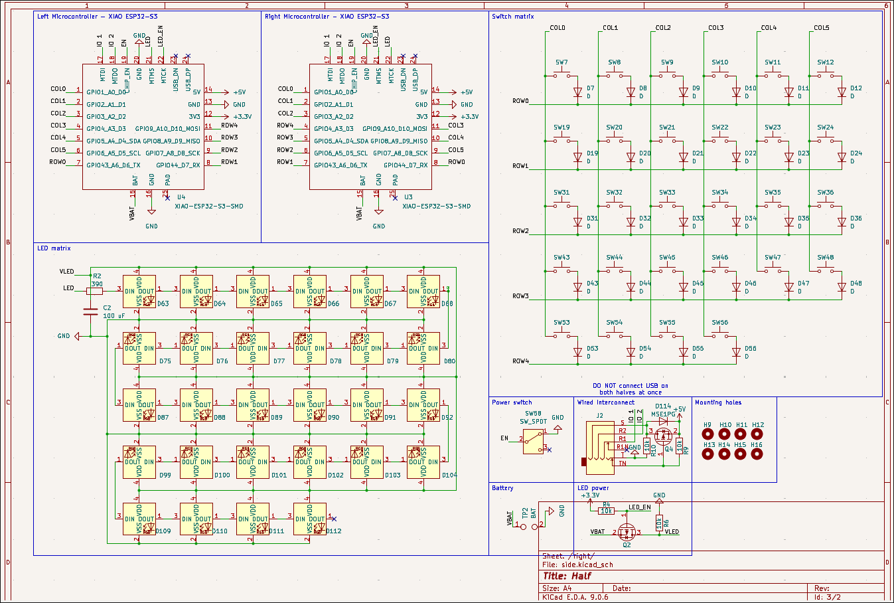
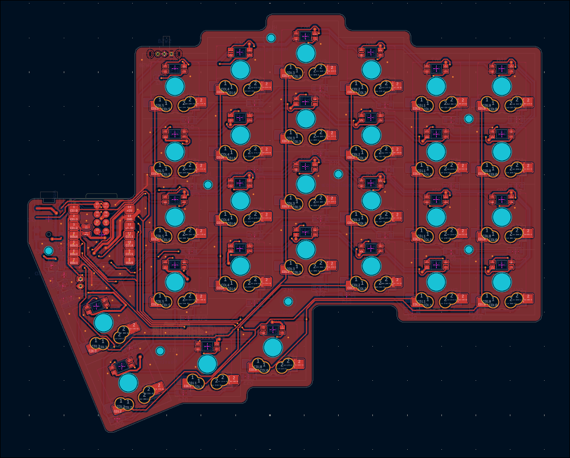
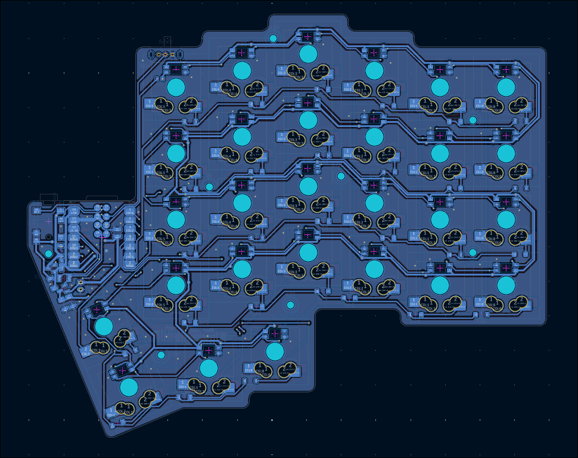
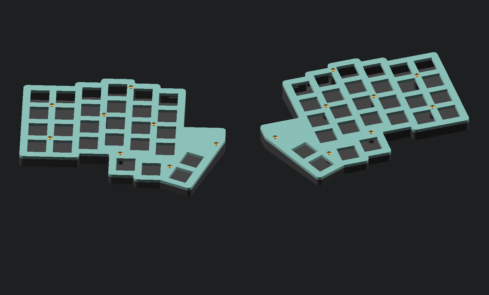
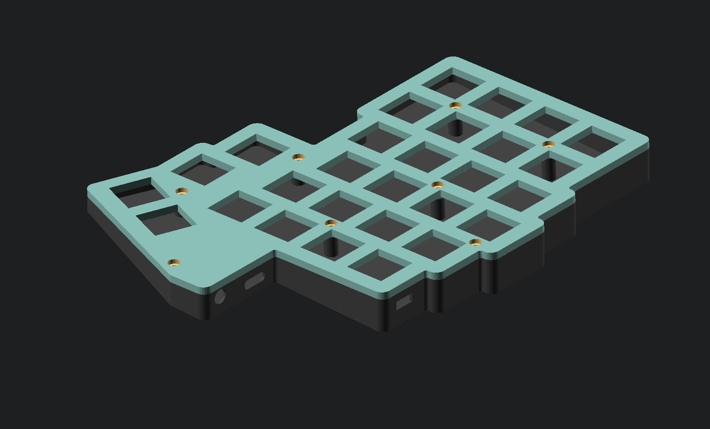
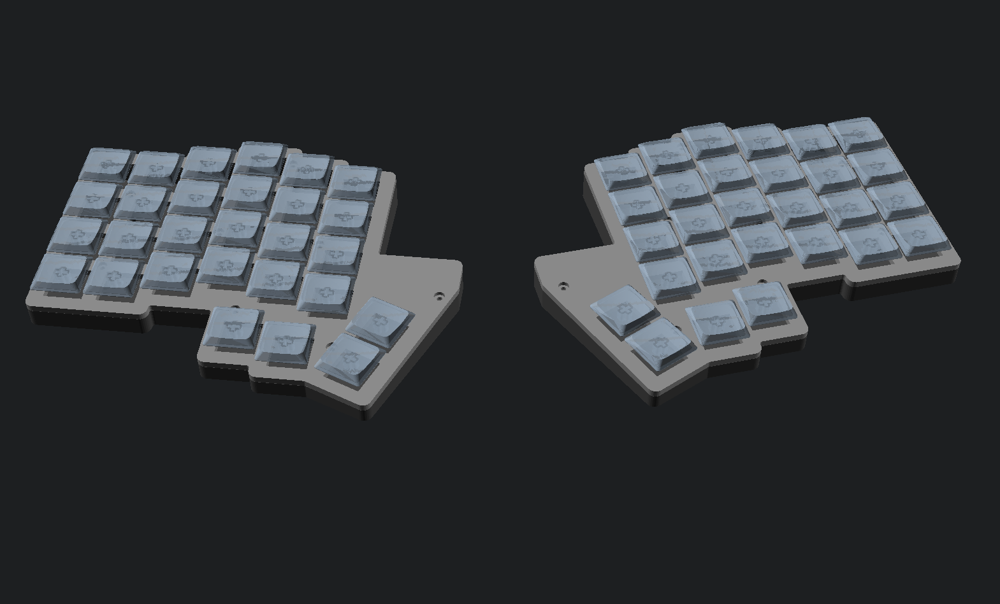
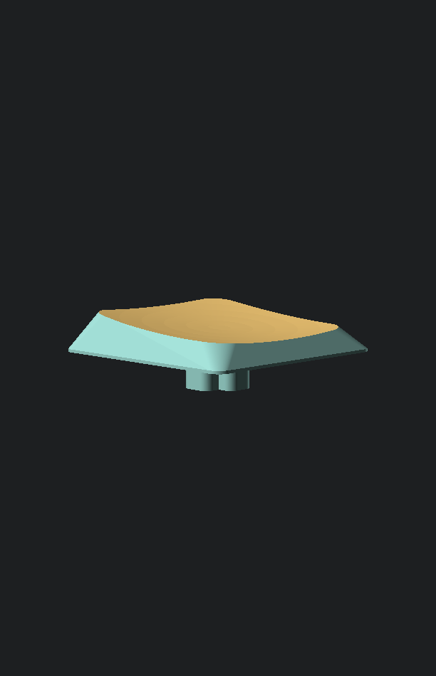

# Keyboard

A low-profile split keyboard with 56 hotswappable, RGB backlit keys. Powered by an ESP32-S3.

This is the first project I'm trying to get a PCB manufactured for. I've polished the design up to a point I'm happy with, but there might be mistakes.

The directory structure should be self-explanatory. Currently, `firmare/` only contains a blink program. I'm still deciding whether I should try porting ZMK (ESP32-S3 requires some work) or writing my own firmware from scratch. The latter option would give me more freedom to experiment with the hardware (I have some unconventional ideas), so I'm leaning towards that.

The BOM does not contain anything for the housing or keycaps, as I intend to resin-print those myself.

**Schematic:**

**PCB:**

**Housing:**

**Keycaps:**

**BOM:**

| Name                                            | Description                                                           | Reference | Link                                                                                                          | Quantity | Unit quantity | Unit price     | Total price | Seller  |
| ----------------------------------------------- | --------------------------------------------------------------------- | --------- | ------------------------------------------------------------------------------------------------------------- | -------- | ------------- | -------------- | ----------- | ------- |
| 3.7V 1000mAh 502450 Lipo                        | Battery                                                               | N/A       | https://www.amazon.com/dp/B07BTV3W87                                                                          | 2        | 2             | 7.4900         | 14.98       | Amazon  |
| CL31A107MQHNNWE                                 | 100uF capacitor for the LEDs                                          | C1-C2     | https://www.digikey.com/en/products/detail/samsung-electro-mechanics/CL31A107MQHNNWE/10479833                 | 2        | 2             | 0.4000         | 0.80        | DigiKey |
| MSE1PG-M3                                       | Diodes for use in the wired interconnect                              | D113-D114 | https://www.digikey.com/en/products/detail/vishay-general-semiconductor-diodes-division/MSE1PG-M3-89A/2149917 | 2        | 2             | 0.1000         | 0.20        | DigiKey |
| 5149-LSH-3956D-005-G-19CT-ND                    | TRRS jacks for wired interconnect                                     | J1-J2     | https://www.digikey.com/en/products/detail/linkplex/LSH-3956D-005-G-19/26798666                               | 2        | 2             | 0.9900         | 1.98        | DigiKey |
| 4786-GSFC02501CT-ND                             | P-channel MOSFETs to toggle power to the LEDs and wired interconnect. | Q1-Q4     | https://www.digikey.com/en/products/detail/good-ark-semiconductor/GSFC02501/18648296                          | 4        | 10            | 0.0390         | 0.39        | DigiKey |
| 311-390GRCT-ND                                  | 390 ohm resistors for the first neopixel input lines                  | R1-R2     | https://www.digikey.com/en/products/detail/yageo/RC0603JR-07390RL/726777                                      | 2        | 10            | 0.0070         | 0.07        | DigiKey |
| 311-10.0KFRCT-ND                                | 10k ohm pull-up/pull-down resistors for MOSFET circuits               | R3-R10    | https://www.digikey.com/en/products/detail/yageo/RC1206FR-0710KL/728483                                       | 8        | 10            | 0.0180         | 0.18        | DigiKey |
| 455-1719-ND                                     | JST battery connector                                                 | TP1-TP2   | https://www.digikey.com/en/products/detail/jst-sales-america-inc/S2B-PH-K-S/926626                            | 2        | 2             | 0.1000         | 0.20        | DigiKey |
| Seeed Studio XIAO ESP32-S3                      | MCU                                                                   | U3-U4     | https://www.digikey.com/en/products/detail/seeed-technology-co-ltd/113991114/19285530                         | 2        | 2             | 7.4900         | 14.98       | DigiKey |
| GATERON Upgrade Hot-swap PCB 2.0 Socket         | Hotswappable switch bracket                                           | SW1-SW56  | https://www.gateron.com/products/gateron-hot-swap-pcb-socket?VariantsId=10170                                 | 56       | 1x70          | 7.0000         | 7.00        | Gateron |
| GATERON KS-33 Low Profile 2.0 Mechanical Switch | Low-profile mechanical switch                                         | N/A       | https://www.gateron.com/products/gateron-ks-33-low-profile-switch-set?VariantsId=11464                        | 56       | 2x35          | 9.8000         | 19.60       | Gateron |
| PCB                                             | The circuit board for the keyboard.                                   | N/A       | N/A                                                                                                           | 1        | 1x5           | 21.8600        | 11.00       | JLC     |
| Stencil                                         | The stencil for soldering the board.                                  | N/A       | N/A                                                                                                           | 1        | 1             | 7.0000         | 7.00        | JLC     |
| 1N4148W                                         | Diodes to prevent key ghosting                                        | D1-D56    | https://www.lcsc.com/product-detail/C51953478.html                                                            | 56       | 56            | 0.0430         | 2.41        | LCSC    |
| SK6812MINI-E                                    | Addressable RGB LEDs for the backlight                                | D57-D112  | https://www.lcsc.com/product-detail/C5149201.html                                                             | 56       | 60            | 0.0683         | 4.10        | LCSC    |
| SK12D07VG5                                      | Power switches                                                        | SW57-SW58 | https://www.lcsc.com/product-detail/C3020419.html                                                             | 2        | 20            | 0.0210         | 0.42        | LCSC    |
|                                                 |                                                                       |           |                                                                                                               |          |               | Tariffs        | 1.50        | DigiKey |
|                                                 |                                                                       |           |                                                                                                               |          |               | Shipping       | 4.99        | DigiKey |
|                                                 |                                                                       |           |                                                                                                               |          |               | Service Charge | 1.55        | Gateron |
|                                                 |                                                                       |           |                                                                                                               |          |               | Shipping       | 8.60        | Gateron |
|                                                 |                                                                       |           |                                                                                                               |          |               | Shipping       | 29.22       | JLC     |
|                                                 |                                                                       |           |                                                                                                               |          |               | Handling Fee   | 3.00        | LCSC    |
|                                                 |                                                                       |           |                                                                                                               |          |               | Shipping       | 8.42        | LCSC    |
|                                                 |                                                                       |           |                                                                                                               |          |               | Sales Tax      | 7.84        |         |
|                                                 |                                                                       |           |                                                                                                               |          |               | Total          | 150.43      |         |